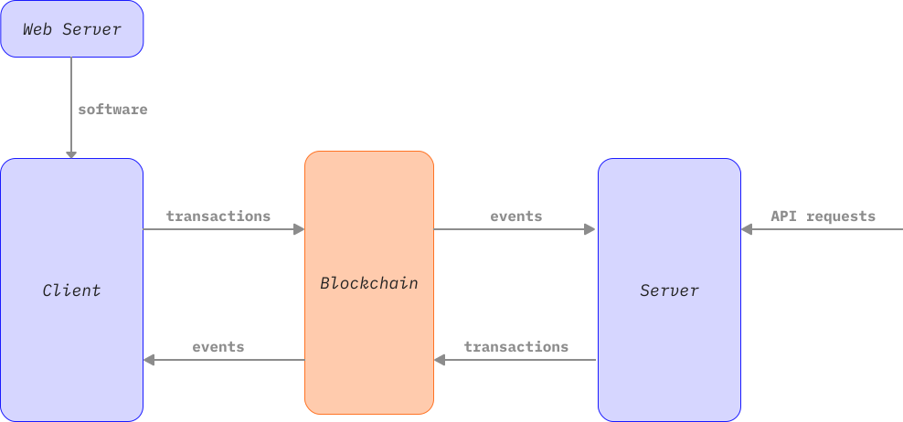

## Introduction {#introduction}

In most cases, a decentralized app uses a server to distribute the software, but all the actual interaction happens between the client (typically, web browser) and the blockchain.


However, there are some cases where an application would benefit from having a server component that runs independently. Such a server would be able to respond to events, and to requests that come from other sources, such as an API, by issuing transactions.



There are several possible tasks for such a server could fulfill.

- Holder of secret state. In gaming it is often useful not to have all the information that the game knows available to the players. However, *there are no secrets on the blockchain*, any information that is in the blockchain is easy for anybody to figure out. Therefore, if part of the game state is to be kept secret, it has to be stored elsewhere (and possibly have the effects of that state verified using [zero-knowledge proofs](/zero-knowledge-proofs)).

- Centralized oracle. If the stakes are sufficiently low, an external server that reads some information online and then posts it to the chain may be good enough to use as an [oracle](/developers/docs/oracles/).

- Agent. Nothing happens on the blockchain without a transaction to activate it. A server can act on behalf of a user to perform actions such as [arbitrage](/developers/docs/mev/#mev-examples-dex-arbitrage) when the opportunity presents itself.

### The sample program {#sample-program}

You can see a sample server [on github](https://github.com/qbzzt/20240715-server-component). This server listens to events coming from [this contract](https://eth-holesky.blockscout.com/address/0xB8f6460Dc30c44401Be26B0d6eD250873d8a50A6?tab=contract_code), a modified version of Hardhat's Greeter. When the greeting is changed, it changes it back.

To run it:

1. Clone the repository.

   ```sh copy
   git clone https://github.com/qbzzt/20240715-server-component.git
   cd 20240715-server-component
   ```

2. Install the necessary packages. If you don't have it already, [install Node first](https://nodejs.org/en/download/package-manager).

   ```sh copy
   npm install
   ```

3. Edit `.env` to specify the private key of an account that has ETH on the Holesky testnet. If you do not have ETH on Holesky, you can [use this faucet](https://holesky-faucet.pk910.de/).

   ```sh filename=".env" copy
   PRIVATE_KEY=0x <private key goes here>
   ```

4. Start the server.

   ```sh copy
   npm start
   ```

5. Go to [a block explorer](https://eth-holesky.blockscout.com/address/0xB8f6460Dc30c44401Be26B0d6eD250873d8a50A6?tab=write_contract), and using a different address than the one that has the private key modify the greeting. See that the greeting is automatically modified back.

## The tools {#the-tools}

These are the tools used by the application.

### Node {#node}

Node 

### TypeScript {#typescript}

### Viem {#viem}

## Listening to events {#listen-events}

## Responding with transactions {#respond-txns}

## Conclusion {#conclusion}